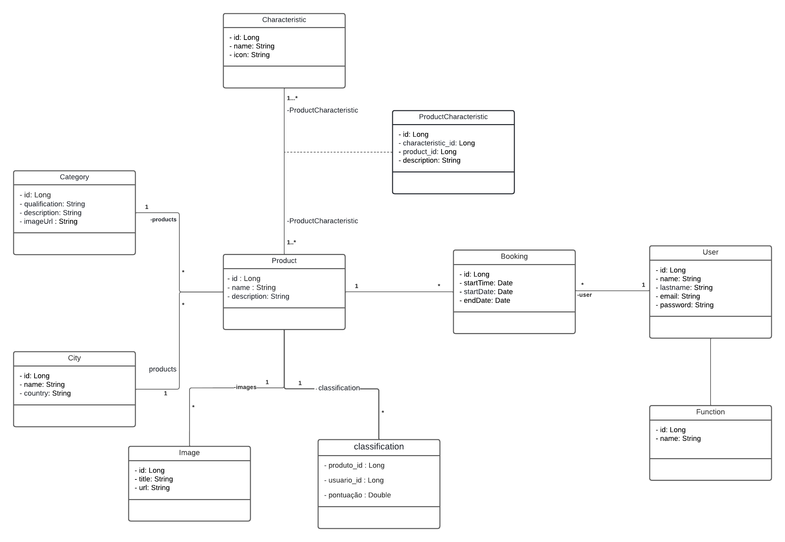
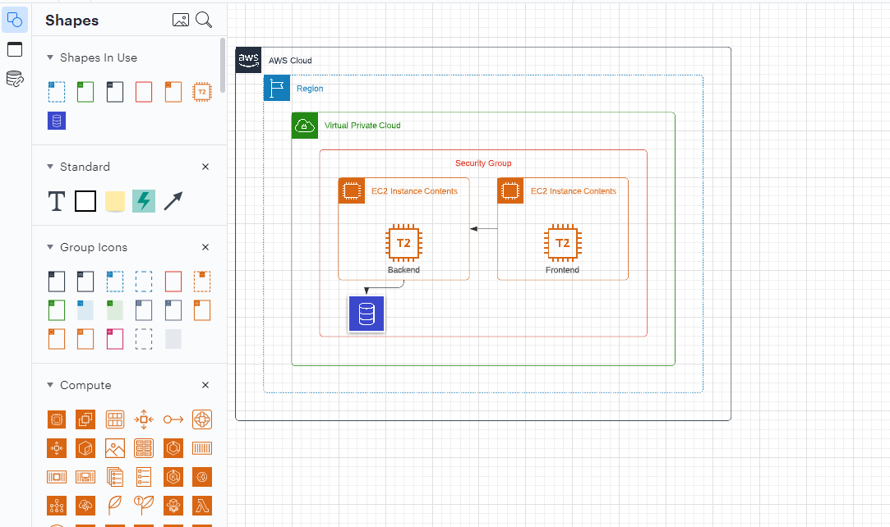
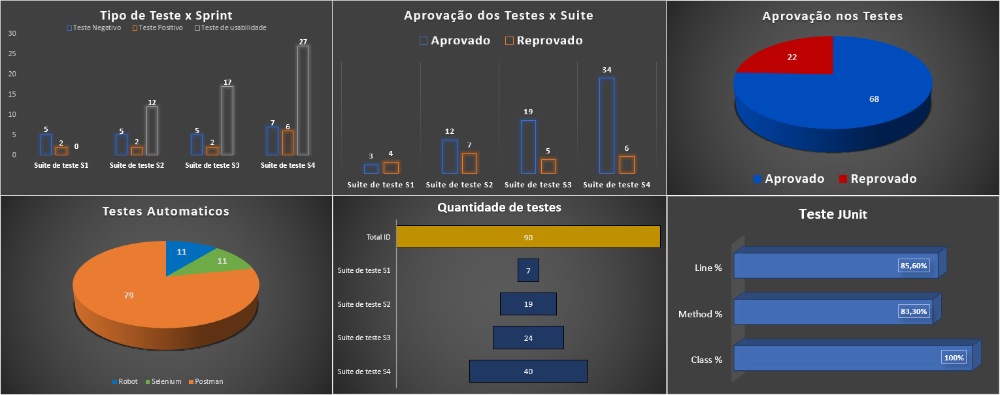

## Projeto

- **Nome do Projeto**: Autolux
- Link do site : http://autolux.ctdprojetos.com.br/

Aluguel de carros exclusivos, veículos sofisticados, potentes e confortáveis, com acessórios e acabamentos à altura da exigência de quem dirige. Além disso, com a experiência única de dirigir um carro com motorização diferenciada e uma performance superior aos demais.

- **Objetivo**: Desenvolver um site para alguel de carros de luxo de forma pratica e rápida, sem muita burocracia e de fácil visualização dos produtos

## Equipe

- **Gabriel Gomes**: Backend, Frontend, Banco de dados, infra;
- **Karina Osuka**: Frontend, UX/UI, infra;
- **Paulo Rossi**: Frontend;
- **Dayana Miranda**: Frontend, infra;
- **Kantuta Molina**: Testing; 

## Metodología de trabalho

- Utilizamos o Scrum como metodología de trabalho, realizando planing, daily, retro e review durante todo processo para que conseguíssemos nos alinharmos e não perder tempo com erros que poderíamos evitar, tivemos algumas dificuldades em certo pontos do projeto, mas sempre que acontecia algo que segurasse nosso grupo por um tempo, nos reuníamos para resolver o problema para o projeto seguir o fluxo normal e entregar tudo dentro do prazo.

- Nós decidimos devidir a equipe em 3 pessoas no front, 1 no back e 1 em testing.
- Como o front tinha muitos detalhes e interações de acessibilidade colocamos mais pessoas.
- Com o back sempre atento e disposto a alterar algo para facilitar o front e entregar oque estava sendo pedido
- Os tetes sempre sendo feitos para que cobrissemos a maior quantidade de erros possíveis 

## Registro do projeto

- Na sprint 1:
    - Estavamos vendo como aplicar e separar as tarefadas dadas, depois que decidimos começamos a trabalhar e entregar tudo que foi pedido, sem muitos problemas.
- Na spring 2:
    - As tarefas começaram a ficar um pouco mais exigentes pedindo algumas coisas que ainda não tinhamos visto, mas com algumas pesquisas e trabalho em equipe conseguimos entregar tudo.
- Na sprint 3: 
    - O backend nesse ponto já estava pronto e sendo moldado sempre que o front precisasse, as tarefas do front eram muitas mas conseguimos entregar tudo no fim da sprint, com todos os testes sendo realizados, encontrando erros que deixamos passar e consequentemente corrigimos.
- Na sprint 4 :
    - Faltava subir o front e o back na AWS e finalizar o front, tivemos problemas na parte da AWS mas com ajuda conseguimos resolver e subimos tudo.
    - OBS: O backend já estava de pé no heroku desde a primeira sprint, com isso conseguimos que o front já estivesse conectado ao back de testes desde o inicio.
---

* Pontos fortes da equipe:
    - Excelente trabalho em equipe
    - Boa comunicação
    - Automotivação
    - Vontade de aprender
    - Proatividade
    - Criatividade

* Pontos fracos:
  - Apresentação do trabalho -> resolvemos com muita conversa sobre como aprensentar da melhor forma.

## Tecnologías utilizadas

  * Front end
    - Reactjs
    - HTML
    - CSS
    - Javascript
    - yarn
    - VSCode
    + Bibliotecas:
      - Bootstrap
      - Axios/Fetch
      - chakra UI
      - Google Maps
      - Phosphor icons
      - Formik
      - Sweet Alert

  * Back end
    - Java
    - Spring Boot
    - Spring Security
    - JWT
    - Arquitetura REST
    - JUnit
    - Intellij

  * Base de datos
    - MySQL
    - Postegres (teste)

  * Infraestructura
    - AWS
    - Heroku (Desenvolvimento)

  * Testing
    - Selenium IDE
    - Robotframework
    - Postman

## Documentação técnica do projeto

* Para rodar o Frontend
    - yarn install
    - yarn start
- Irá encontrar todos os componentes na pasta de componentes 
- Sempre criar um componente com a primeira letra maiúscula e seguir no modelo camelcase
- Ao implementar uma nova funcionalidade e verificar que está tudo ok e realizar o commit na hora que foi feito antes continuar
- Commits sempre bem descritivos sobre oque aconteceu

* Base de datos
    - Tera acesso a toda informação do banco de dados nesse link https://www.notion.so/Banco-de-dados-1a5ebd5c035a48329c33114c79840045

* Componentes e diagramas do backend

  
  - Acesso as rotas e descrições da nossa API : https://back-end-booking.herokuapp.com/swagger-ui/index.html#/

* Infraestructura

  

* Testing e qualidade

